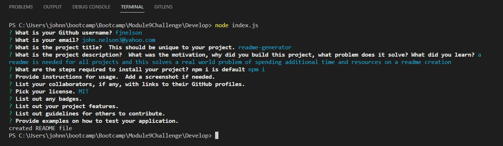

# Module9Challenge_READMEchampion

## Description

Bootcamp: Module 9 Challenge  
Node.js Challenge: Professional README Generator  
Codebase correction that follows accessibility standards so that the site is optimized for search engines
How to create a Professional README: (https://coding-boot-camp.github.io/full-stack/github/professional-readme-guide)
Uses Inquirer@8.2.4 - https://www.npmjs.com/package/inquirer/v/8.2.4

## Table of Contents (Optional)

N/A

## Installation

open integrated terminal for index.js and run 'npm i'

## Usage
Screenshot of readme creation

Video of readme creation
[Video Demo](https://drive.google.com/file/d/1-9-ws-nqSgLE61P9bAHFHFccgSLwf54W/view)

## Credits

Starter code from:
gachoi06 - Jan 2022 - original from Xandromus - March 2020
https://github.com/coding-boot-camp/potential-enigma

Ideas of outputs taken from:
mmeii - Dec 2020
https://github.com/mmeii/9-good-readme-generator

sylviaprabudy - July 2020
https://github.com/sylviaprabudy/readme-generator

## License

Please refer to the LICENSE in the repo.
